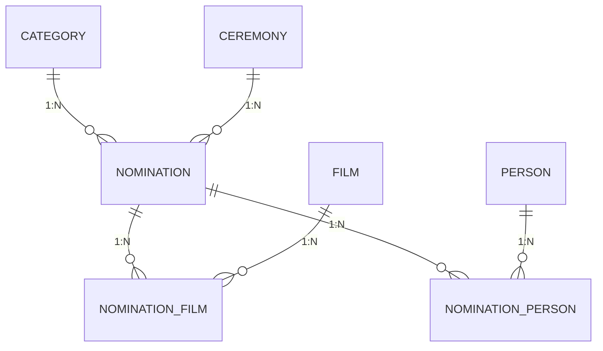

# 🎬 filmes-noite

Sistema para consultar dados históricos das premiações do Oscar (Academy Awards), desenvolvido como atividade prática do curso Técnico em Desenvolvimento de Sistemas (SENAI). O dataset original em CSV é transformado em banco relacional e exposto por uma API.

> 📌 Este README traz uma visão geral e direta do projeto. A documentação completa de cada etapa fica na pasta [`docs/`](docs/).

## Etapas do projeto

- [x] **Banco de dados e ORM** — modelagem, tabelas e integração com Sequelize
- [ ] **Backend** — rotas, controllers e services (Express)
- [ ] **Testes automatizados** — cobertura de services e controllers
- [ ] **Frontend** — consumo da API

## Stack

| Camada | Tecnologia |
|---|---|
| Banco de dados | PostgreSQL |
| ORM | Sequelize |
| API | Node.js + Express |
| Testes | Node test runner (`node --test`) |

## Modelo de dados



| Tabela | O que representa |
|---|---|
| `category` | Categoria do prêmio (ex: Melhor Diretor), agrupada em uma classe (`class`) |
| `ceremony` | Cada edição/ano da cerimônia do Oscar |
| `nomination` | Uma indicação em uma categoria, dentro de uma cerimônia |
| `film` | Filme indicado |
| `person` | Pessoa indicada (ator, diretor, etc.) |
| `nomination_film` | Liga uma indicação a um ou mais filmes, com detalhe (personagem/música) |
| `nomination_person` | Liga uma indicação a uma ou mais pessoas |

Detalhes de cada coluna, decisões de modelagem e a implementação no Sequelize estão em [`docs/database.md`](docs/database.md).

## Como rodar (banco + ORM)

```bash
# na pasta backend/
cp .env.example .env   # preencha PORT e DATABASE_URL
npm install
npm run dev             # ou: npm start
```

Ao subir, a aplicação conecta no PostgreSQL e sincroniza as tabelas automaticamente (`sequelize.sync`).

## Documentação completa

- 📗 [Banco de dados e ORM](docs/database.md)
- 📙 Backend (rotas, controllers, services) — em breve
- 🧪 Testes automatizados — em breve
- 📘 Frontend — em breve