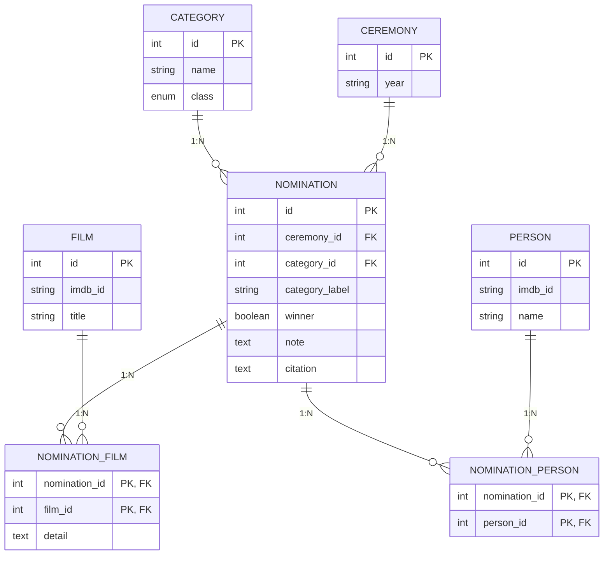

# Banco de dados e ORM

Esta é a documentação completa da **primeira etapa** do projeto: transformar o dataset de premiações do Oscar (CSV) em um banco de dados relacional, modelado e integrado via Sequelize.

As próximas etapas terão seus próprios documentos nesta mesma pasta: `docs/backend.md`, `docs/tests.md` e `docs/frontend.md`.

## Índice

- [Diagrama Entidade-Relacionamento](#diagrama-entidade-relacionamento)
- [Dicionário de dados](#dicionário-de-dados)
- [Relacionamentos](#relacionamentos)
- [Decisões de modelagem](#decisões-de-modelagem)
- [Organização do ORM (Sequelize)](#organização-do-orm-sequelize)

## Diagrama Entidade-Relacionamento



## Dicionário de dados

### `category`

| Coluna | Tipo | Restrições | Origem / observação |
|---|---|---|---|
| `id` | INTEGER | PK, auto-incremento | — |
| `name` | STRING(120) | NOT NULL, UNIQUE | Coluna `CanonicalCategory` do CSV (66 valores padronizados) |
| `class` | ENUM | NOT NULL | Coluna `Class` do CSV — grupo macro da categoria (`Acting`, `Directing`, `Music`, `Production`, `SciTech`, `Special`, `Title`, `Writing`) |

### `ceremony`

| Coluna | Tipo | Restrições | Origem / observação |
|---|---|---|---|
| `id` | INTEGER | PK, **sem** auto-incremento | Coluna `Ceremony` do CSV — número da edição (1 a 98), usado como chave natural |
| `year` | STRING(9) | NOT NULL | Coluna `Year`; pode vir como intervalo, ex: `"1927/28"` |

### `film`

| Coluna | Tipo | Restrições | Origem / observação |
|---|---|---|---|
| `id` | INTEGER | PK, auto-incremento | — |
| `imdb_id` | STRING(12) | UNIQUE, aceita nulo | Coluna `FilmId`, formato `tt0019217` |
| `title` | STRING(255) | NOT NULL | Coluna `Film` |

### `person`

| Coluna | Tipo | Restrições | Origem / observação |
|---|---|---|---|
| `id` | INTEGER | PK, auto-incremento | — |
| `imdb_id` | STRING(12) | UNIQUE, aceita nulo | Coluna `NomineeIds`, formato `nm0001932`. Nulo em 527 linhas: prêmios honorários e empresas nas categorias `SciTech` |
| `name` | STRING(255) | NOT NULL | Coluna `Nominees` |

### `nomination`

| Coluna | Tipo | Restrições | Origem / observação |
|---|---|---|---|
| `id` | INTEGER | PK, auto-incremento | — |
| `ceremony_id` | INTEGER | FK → `ceremony.id`, NOT NULL | — |
| `category_id` | INTEGER | FK → `category.id`, NOT NULL | — |
| `category_label` | STRING(120) | NOT NULL | Coluna `Category` do CSV — o rótulo usado **naquele ano específico** (existem ~130 variações históricas, que mapeiam para as 66 categorias canônicas de `category.name`) |
| `winner` | BOOLEAN | NOT NULL, default `false` | Coluna `Winner`, que no CSV vem como `"True"` ou vazio |
| `note` | TEXT | aceita nulo | — |
| `citation` | TEXT | aceita nulo | — |

### `nomination_film` (tabela de junção N:N com atributo)

| Coluna | Tipo | Restrições | Origem / observação |
|---|---|---|---|
| `nomination_id` | INTEGER | PK, FK → `nomination.id` | — |
| `film_id` | INTEGER | PK, FK → `film.id` | — |
| `detail` | TEXT | aceita nulo | Coluna `Detail` do CSV: personagem interpretado ou nome da música. Sempre relativo ao **filme**, por isso mora aqui e não em `nomination_person` |

### `nomination_person` (tabela de junção N:N pura)

| Coluna | Tipo | Restrições | Origem / observação |
|---|---|---|---|
| `nomination_id` | INTEGER | PK, FK → `nomination.id` | — |
| `person_id` | INTEGER | PK, FK → `person.id` | — |

Sem colunas extras — é criada automaticamente pelo Sequelize a partir do `belongsToMany`.

## Relacionamentos

| Relação | Tipo | Como é feita |
|---|---|---|
| Cerimônia → Indicação | 1:N | `ceremony_id` em `nomination` |
| Categoria → Indicação | 1:N | `category_id` em `nomination` |
| Indicação ↔ Filme | N:N | via `nomination_film` (carrega `detail`) |
| Indicação ↔ Pessoa | N:N | via `nomination_person` (tabela pura) |

## Decisões de modelagem

- **`ceremony.id` não é auto-incremento**: usa o próprio número da edição do CSV como chave natural, em vez de gerar um id substituto.
- **`category.name` vs. `nomination.category_label`**: o nome da categoria mudou de rótulo várias vezes ao longo da história do Oscar (~130 variações). `category.name` guarda a versão canônica/padronizada (66 valores) e `category_label` preserva o rótulo exato usado naquele ano, sem perder informação histórica.
- **`detail` fica em `nomination_film`, não em `nomination_person`**: o detalhe (personagem ou música) é sempre relativo ao filme, mesmo quando a indicação também está ligada a uma pessoa.
- **`imdb_id` aceita nulo em `film` e `person`**: nem todo registro histórico tem um ID do IMDb associado (ex: prêmios honorários).
- **`timestamps: false` em todos os models**: os dados são uma carga histórica estática (importação única do dataset), não geram novos registros via uso da aplicação, então `createdAt`/`updatedAt` não fazem sentido aqui.

## Organização do ORM (Sequelize)

```
backend/
├── config/
│   └── database.js        # conexão (Sequelize + Postgres)
├── models/
│   ├── category.model.js
│   ├── ceremony.model.js
│   ├── film.model.js
│   ├── person.model.js
│   ├── nomination.model.js
│   ├── nomination_film.model.js
│   └── relationships.js   # centraliza todas as associações
└── app.js                 # sobe a conexão e sincroniza as tabelas
```

- **`config/database.js`**: cria a instância do Sequelize a partir de `DATABASE_URL` (variável de ambiente), com `dialect: "postgres"` e SSL habilitado — necessário para bancos hospedados na nuvem.
- **Um arquivo por tabela em `models/`**: cada model declara suas colunas, `tableName` explícito (snake_case) e `timestamps: false`.
- **`relationships.js` centraliza as associações**, em vez de cada model declarar suas próprias relações. Isso evita um problema comum de import circular (ex: `nomination.model.js` precisando importar `film.model.js` e vice-versa) e deixa todas as relações do banco visíveis em um único lugar:

  ```js
  // Alternativa mais direta/básica: cada model declara sua própria relação
  // (models/category.model.js)
  import Nomination from './nomination.model.js';
  Category.hasMany(Nomination, { foreignKey: 'category_id' });
  ```

  ```js
  // Abordagem usada no projeto: associações centralizadas em relationships.js
  import Category from './category.model.js';
  import Nomination from './nomination.model.js';

  Category.hasMany(Nomination, { foreignKey: 'category_id', as: 'nominations' });
  Nomination.belongsTo(Category, { foreignKey: 'category_id', as: 'category' });
  ```

  A primeira forma parece mais simples à primeira vista, mas espalha as relações entre vários arquivos e cria risco de import circular quando duas tabelas se referenciam mutuamente (como acontece aqui). A segunda mantém os models "burros" (só estrutura) e todo o desenho do relacionamento em um só lugar.

- **`app.js`**: na inicialização, autentica a conexão e roda `sequelize.sync({ alter: true })`, que cria/ajusta as tabelas automaticamente a partir dos models. Isso é prático nesta fase do projeto, mas vale registrar: para um ambiente de produção real, o ideal seria trocar por migrations (Sequelize CLI), já que `alter: true` pode fazer alterações não previstas no schema em produção.